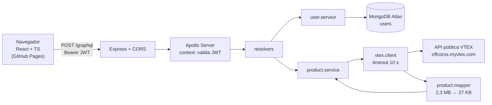
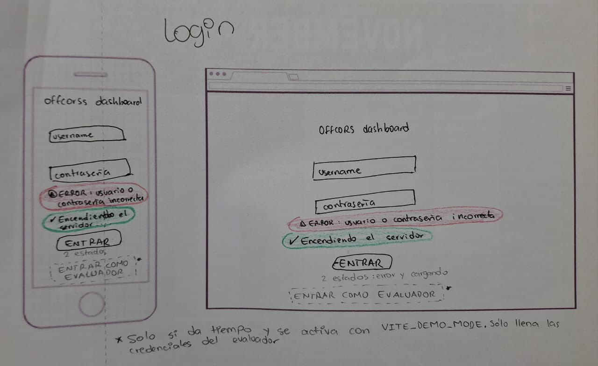
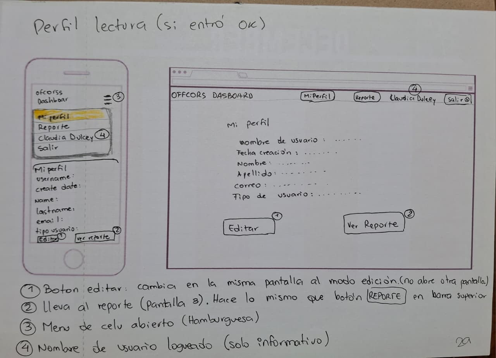
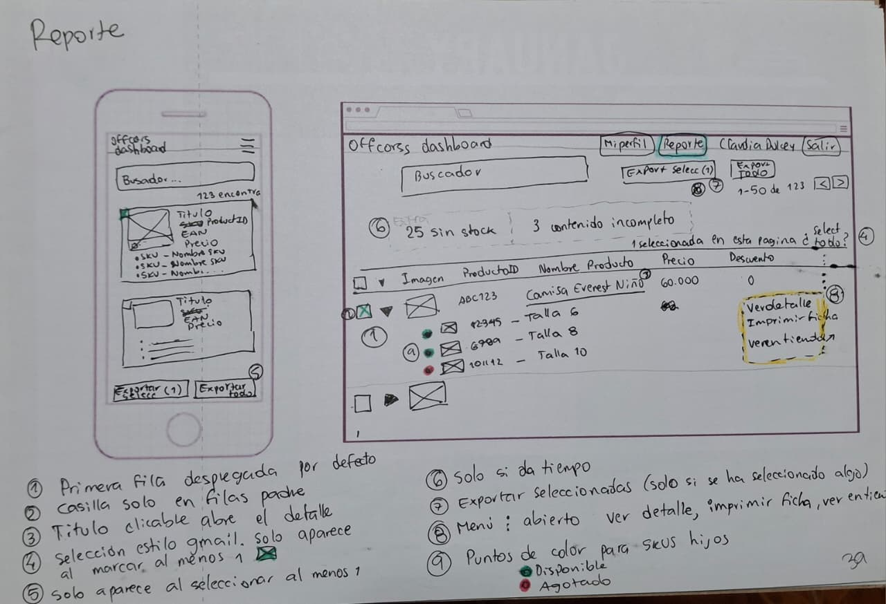
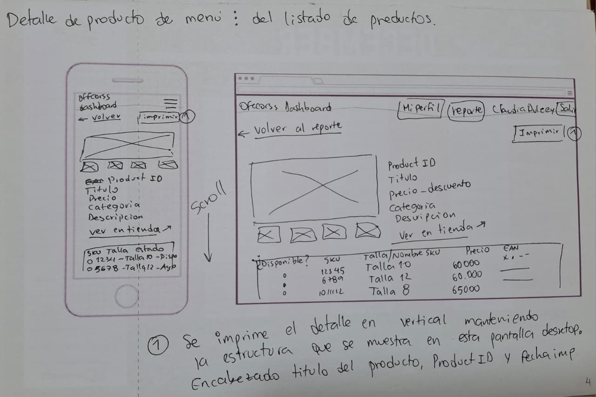

# Offcorss Dashboard

Prueba técnica para el cargo **Coordinador(a) de Plataforma Ecommerce** de Offcorss.
Aplicación con inicio de sesión, perfil editable y un reporte de productos que consulta en vivo el catálogo público de VTEX de offcorss.com, con exportación a CSV e impresión.

| | |
|---|---|
| **App** | https://claudidu.github.io/offcorss-dashboard/ |
| **API (GraphQL)** | https://offcorss-dashboard-api.onrender.com/graphql · estado: [`/health`](https://offcorss-dashboard-api.onrender.com/health) |
| **Repositorio** | https://github.com/Claudidu/offcorss-dashboard |

**Usuario de prueba:** `evaluador` · la contraseña va en el correo de entrega (el repositorio es público, así que no publico credenciales).

> ⏱ **El primer ingreso puede tardar unos 50 segundos.** El servidor está en el plan gratuito de Render, que se apaga tras 15 minutos sin uso. La pantalla de login lo avisa ("Encendiendo el servidor…"). Después responde normal.

---

## Contenido

1. [Qué hace](#qué-hace)
2. [Requisitos de la prueba](#requisitos-de-la-prueba)
3. [Arquitectura](#arquitectura)
4. [Decisiones (ADR)](#decisiones-adr)
5. [Lo que aprendí de la API de VTEX](#lo-que-aprendí-de-la-api-de-vtex)
6. [Seguridad](#seguridad)
7. [Rendimiento](#rendimiento)
8. [Diseño, accesibilidad y W3C](#diseño-accesibilidad-y-w3c)
9. [Despliegue](#despliegue)
10. [Correr el proyecto en local](#correr-el-proyecto-en-local)
11. [Qué haría con más tiempo](#qué-haría-con-más-tiempo)

---

## Qué hace

| Pantalla | Ruta | Qué permite |
|---|---|---|
| Login | `#/login` | Entrar con usuario y contraseña. Botón 👁 para ver la contraseña. |
| Mi perfil | `#/perfil` | Ver los datos del usuario (pantalla de llegada) y editar Name, Last Name y Email. Username, Create Date y User Type son de solo lectura. |
| Reporte | `#/reporte` | Catálogo de Offcorss en vivo: búsqueda, paginación de 50, filas de producto con sus SKU (tallas) desplegadas, selección que se conserva entre páginas, exportar seleccionadas o todo a CSV, imprimir el listado. |
| Detalle | `#/producto/:id` | Ficha con galería, precios, descripción, categoría y tabla de SKU. Versión imprimible. |

En el celular, el menú se recoge en ☰, el reporte se muestra como tarjetas y aparece una barra fija para exportar cuando hay productos seleccionados.

## Requisitos de la prueba

Texto del enunciado, punto por punto.

**Backend y base de datos**

| Requisito | Estado | Dónde está |
|---|---|---|
| Crear un servicio con Node.js para realizar peticiones HTTP | ✅ | `backend/` (Express 5) · `vtex.client.ts` |
| Consumir el API de productos de VTEX (`/api/catalog_system/pub/products/search/`) | ✅ | `vtex.client.ts` + `product.mapper.ts` |
| MongoDB / MariaDB | ✅ | MongoDB Atlas · `user.model.ts` |
| Consumir la base de datos usando GraphQL | ✅ | Apollo Server: `login`, `me`, `updateMe` |

**Frontend**

| Requisito | Estado | Dónde está |
|---|---|---|
| Dashboard que requiera login (debe validar al usuario en la DB) | ✅ | `LoginPage.tsx` → mutación `login` (bcrypt + JWT) |
| Vista de detalle del usuario: al ingresar, mostrar Username, Create Date, Name, Last Name, Email, User Type | ✅ | `ProfilePage.tsx` → consulta `me` (pantalla de llegada) |
| Los datos del usuario se deben poder editar y actualizar en la DB | ✅ | Modo edición → mutación `updateMe` |
| Vista de listado de productos que consuma el servicio de VTEX | ✅ | `ReportPage.tsx` → consulta `products` |
| Al menos 5 campos: productId, Brand, productTitle, ítems (listado de itemId), images | ✅ | Fila de producto + filas hijas con cada itemId, talla y miniatura |
| Pueden agregarse campos adicionales | ✅ | Precio\*, Descuento\*, disponibilidad, enlace a la tienda (marcados con \*) |
| Seleccionar filas y exportar a .csv | ✅ | "Exportar seleccionadas (n)" y "Exportar todo" |
| Paginación | ✅ | 50 por página, con el total real |
| Filtrar por texto | ✅ | Buscador (`ft` de VTEX) |
| Vista de detalle del producto con los 5 campos y los adicionales que se desee | ✅ | `ProductPage.tsx`: galería, categoría\*, descripción\*, tabla de SKU con EAN\* |
| La vista de detalle debe poderse imprimir | ✅ | Botón "Imprimir" + `@media print` (también se imprime el listado) |
| Logout | ✅ | Botón "Salir" en la barra |

**Publicación y entrega**

| Requisito | Estado | Dónde está |
|---|---|---|
| Backend publicado (sugerido: Render) | ✅ | [offcorss-dashboard-api.onrender.com](https://offcorss-dashboard-api.onrender.com/health) |
| Frontend publicado (sugerido: GitHub Pages) | ✅ | [claudidu.github.io/offcorss-dashboard](https://claudidu.github.io/offcorss-dashboard/) |
| Compartir el repositorio con `narvaezcarlos` | ✅ | Invitado como colaborador (el repositorio además es público) |

**Recomendaciones y lo que se tomará en cuenta**

| Punto | Qué hice |
|---|---|
| Usar Tachyons | ✅ Todo el maquetado; solo los colores y botones de marca van en `index.css` |
| Optimización de imágenes | ✅ Miniaturas pedidas a VTEX en el tamaño exacto (120 / 80 / 600 px), `loading="lazy"`, `width` y `height` declarados |
| Desarrollos adicionales | Impresión del listado, "Exportar todo" con progreso, selección que se conserva entre páginas, estado en la URL, vista de celular con tarjetas |
| Transiciones y efectos CSS | Transiciones en botones y estados *hover* |
| Integraciones con desarrollos externos | VTEX (catálogo en vivo), MongoDB Atlas, Google Fonts |
| Buenas prácticas de HTML | Etiquetas semánticas (`main`, `nav`, `header`, `article`, `dl`), `label` en cada campo, atributos ARIA, `lang="es"` |
| Validador W3C | ✅ Ver [resultados](#diseño-accesibilidad-y-w3c) |

## Arquitectura

**Monolito modular en capas, usado como Backend for Frontend (BFF).** El navegador solo habla con mi servidor, y mi servidor habla con MongoDB y con VTEX.



**Por qué hace falta un backend** (salió de los requisitos, no de una preferencia):

| Requisito | ¿Puede vivir solo en el navegador? | Por qué |
|---|---|---|
| Autenticar usuarios | No | El código del navegador es visible y modificable |
| Guardar usuarios en MongoDB | No | Las credenciales de la base quedarían expuestas |
| Consultar VTEX | No | VTEX bloquea CORS (lo comprobé) y cada producto pesa ~230 KB |
| Exportar CSV e imprimir | Sí | Se quedó en el frontend |

**Estructura del repositorio**

```
backend/
  src/
    config/env.ts           variables de entorno validadas con zod (falla al arrancar si falta algo)
    db/mongo.ts             conexión a Atlas
    graphql/context.ts      lee el token de cada petición
    modules/
      users/                model · service · typeDefs · resolvers
      products/             vtex.types · vtex.client · product.mapper · service · typeDefs · resolvers
    scripts/
      seed.ts               crea o restablece al usuario evaluador (idempotente)
      measure-vtex.ts       mide el peso de VTEX frente al mapeado
    server.ts
frontend/
  src/
    api/                    graphql.ts (cliente fetch) · products.ts
    auth/AuthContext.tsx    sesión compartida por toda la app
    components/             ProtectedLayout · ProductRows · ProductCard · Dot
    pages/                  Login · Profile · Report · Product
    utils/                  csv · format · images
```

## Decisiones (ADR)

Cada decisión con su contexto y su costo.

| # | Decisión | Contexto | Consecuencia |
|---|---|---|---|
| 1 | **Backend intermediario (BFF)** | VTEX bloquea CORS; la autenticación y Mongo necesitan un entorno confiable | Un despliegue más, a cambio de seguridad y control del formato |
| 2 | **Monolito modular** | Dos dominios de negocio (usuarios, productos), una persona, cuatro días | Simple de desplegar. Los módulos ya tienen fronteras: se pueden separar si crece |
| 3 | **JWT sin estado** | Render gratis reinicia y duerme el servidor | Las sesiones sobreviven a los reinicios; cerrar sesión es borrar el token |
| 4 | **Mapper (capa anticorrupción)** | El JSON de VTEX es enorme y cambia a su ritmo | Respuesta 84 veces más liviana; un cambio en VTEX toca un solo archivo |
| 5 | **Patrón "Productos y SKU" del admin de VTEX** | Es la vista que el equipo de ecommerce usa a diario | Filas de producto con sus SKU desplegados, punto ● disponible / ○ agotado, itemId siempre visible |
| 6 | **`fetch` simple en lugar de Apollo Client** | Cuatro pantallas, sin caché compleja | Una función `gql<T>` de ~40 líneas, sin dependencia extra. Ver "Qué haría con más tiempo" |
| 7 | **"Exportar todo" en el frontend, página por página** | Una página de 50 productos pesa ~11 MB en VTEX y Render gratis tiene 512 MB de memoria | El navegador pide página a página y muestra el progreso; el servidor nunca carga todo a la vez |
| 8 | **CSV con `;`, BOM UTF-8 y una fila por SKU** | Excel en español usa `;` y sin BOM rompe tildes y ñ | Se abre bien con doble clic; cada talla queda con su disponibilidad y EAN |
| 9 | **Estado del reporte en la URL** (`#/reporte?q=camiseta&page=2`) | El usuario va al detalle y vuelve | F5 y "Volver" conservan la página y la búsqueda; el enlace se puede compartir |
| 10 | **HashRouter** | GitHub Pages no reescribe rutas a `index.html` | Las rutas usan `#/`, sin configurar el servidor |

## Lo que aprendí de la API de VTEX

Antes de diseñar hice un *spike* (prueba corta) contra `api/catalog_system/pub/products/search`. Estos hallazgos definieron la arquitectura:

- **CORS bloqueado.** Desde otro dominio el navegador rechaza la respuesta. Por eso la consulta va de servidor a servidor.
- **Paginación con `206 Partial Content`.** Máximo 50 productos por petición (`_from` / `_to`); el total viene en el header `resources` (`0-49/2872`).
- **El catálogo tiene 2.872 productos, pero la API pública no entrega más allá del resultado 2.500** (página 50). El reporte muestra el total real, detiene "Siguiente" en la página 50 con un aviso que invita a buscar, y "Exportar todo" dice cuántos exportará.
- **Peso.** 10 productos = **2.315 KB** en VTEX → **27,5 KB** después del mapper: **84 veces menos**. Se reproduce con `npm run measure:vtex` (en `backend/`).
- **Stock topado.** `AvailableQuantity` solo vale 0 o 10: sirve para disponible/agotado, no como inventario.
- **Precio del producto** = el SKU disponible más barato. Descuento = `round((1 − precio / precio_lista) × 100)`.
- **Imágenes repetidas.** Cada SKU trae la misma foto con un id distinto; la galería las deduplica por nombre de archivo (producto 51343501: 6 imágenes en vez de 30).
- **Talla como texto.** Viene como arreglo (`['10']`) e incluye meses y *toddler* (`12M`, `2T`).
- **`link` apunta al dominio interno** (`offcorss.myvtex.com`). El enlace a la tienda se arma con `linkText`: `https://www.offcorss.com/<linkText>/p`.
- Búsqueda de ejemplo: "camiseta" = 1.038 resultados (21 páginas).
- **"Exportar todo" con "pantalón"** (368 productos, 8 páginas) tarda unos **25 segundos** la primera vez y unos **17 segundos** la segunda (≈ 2–3 s por página), en la versión publicada. Cada página es una petición a VTEX a través del backend, en secuencia y con una barra de progreso.

## Seguridad

- Contraseñas con **bcrypt**; el hash nunca sale de la base (`select: false`).
- **JWT** firmado, con expiración de 8 h y un secreto distinto en local y en producción.
- **Mismo mensaje** para usuario inexistente y contraseña equivocada (no revela qué usuarios existen).
- `updateMe` acepta **solo una lista blanca** de campos (Name, Last Name, Email): no se puede cambiar el rol ni el username desde el cliente.
- **Validación doble:** el navegador valida para responder rápido; el backend vuelve a validar con zod, porque es la que da seguridad.
- **CORS** limitado a una lista de orígenes (GitHub Pages y localhost).
- **Mínimo privilegio:** el usuario de Atlas solo lee y escribe; Render solo tiene acceso a este repositorio.
- Sin secretos en el repo: `.env` ignorado, `.env.example` como plantilla. El historial se revisó antes de hacerlo público.
- Enlaces externos con `rel="noopener noreferrer"`.
- **Limitación conocida:** el token se guarda en `localStorage`, que es vulnerable si la página sufriera XSS. En producción usaría una cookie `httpOnly`.

## Rendimiento

- **Mapper:** 84 veces menos datos por la red (ver arriba).
- **Imágenes en el tamaño exacto:** VTEX redimensiona por URL (`/ids/905042-120-120/`). Se piden miniaturas de 120 px en el reporte, 80 px en la galería y 600 px en el detalle, en lugar de las originales.
- **`loading="lazy"`** en las miniaturas: solo se descargan las que entran en pantalla.
- `width` y `height` declarados en las imágenes para que la página no salte al cargar.
- Timeout de 10 s hacia VTEX, con un error claro si no responde.

## Diseño, accesibilidad y W3C

- **Wireframes en papel** antes de programar: cada pantalla en celular y escritorio, con sus estados de carga, vacío y error, y notas numeradas.

| Login | Perfil | Reporte | Detalle |
|---|---|---|---|
|  |  |  |  |

Todos los bocetos: [`docs/wireframes/`](docs/wireframes/) (incluye edición del perfil, estados del reporte y la pantalla de Usuarios, que quedó como extra).

**Del boceto a la app: qué cambió y por qué**

| En el boceto | En la app | Motivo |
|---|---|---|
| Menú ⋮ por fila (ver detalle, imprimir, ver en tienda) | Título clicable + enlace "Tienda ↗" | Un clic menos; imprimir se hace desde el detalle |
| Aviso "¿Seleccionar todo?" tipo Gmail | "Seleccionar los 50 de esta página" | Tiempo; queda en "Qué haría con más tiempo" |
| Panel de agotados / contenido incompleto | No se hizo | Extra marcado "solo si da tiempo" |
| Botón "Entrar como evaluador" | No se hizo | Extra marcado "solo si da tiempo" |
| Estado de carga tipo *skeleton* | Texto "Cargando productos…" | Más simple; el skeleton queda como mejora |
| Pantalla de Usuarios (solo admin) | No se hizo | Extra; requiere el rol `viewer` |
| Puntos de disponibilidad verde / rojo | ● verde = disponible, ○ vacío = agotado | Se distinguen por la forma, no solo por el color: sirven impresos en blanco y negro y para personas con daltonismo |
| Versión impresa (no bocetada) | Diseñada directamente con `@media print` | Se definió por escrito (encabezado con fecha, una sola imagen, sin barra ni botones) y se verificó en la vista previa de impresión |
- **Colores aproximados a www.offcorss.com** (navy, rojo, gris claro) y tipografía Montserrat. Son aproximados: no tuve acceso a la guía de marca oficial, así que no usé el logo.
- Estilos con **Tachyons** (clases utilitarias) y variables CSS para los colores.
- Accesibilidad: cada campo con su `<label>`, `aria-expanded` en el menú ☰ y en las filas desplegables, `aria-pressed` en el botón 👁, mensajes de error con `role="alert"`, `lang="es"`.
- **Impresión:** `@media print` oculta barra, botones y casillas; la ficha lleva encabezado con fecha, una sola imagen y la URL de la tienda escrita.

**Validación W3C** (validator.w3.org):

<!-- COMPLETAR con capturas (docs/w3c/) -->

| Pantalla | Resultado |
|---|---|
| `index.html` publicado | ✅ 0 errores <!-- confirmar 0 avisos tras quitar las barras finales --> |
| Login | ⏳ |
| Perfil (lectura y edición) | ⏳ |
| Reporte | ⏳ |
| Detalle | ⏳ |

Como React dibuja la página con JavaScript, la URL publicada solo contiene el "cascarón". Para validar cada pantalla copié el HTML ya renderizado desde DevTools (*Copy outerHTML*), le agregué `<!doctype html>` (DevTools no lo copia) y lo pegué en *Validate by Direct Input*. Lo hice en una ventana de incógnito: las extensiones del navegador insertan atributos propios en el HTML (por ejemplo `cz-shortcut-listen`, de ColorZilla) que no son parte de la app.

## Despliegue

| Pieza | Dónde | Cómo |
|---|---|---|
| Frontend | GitHub Pages | `npm run deploy` en `frontend/`: compila con Vite y publica la carpeta `dist/` en la rama `gh-pages`, que es la que sirve GitHub Pages. `main` guarda solo el código fuente |
| Backend | Render (Free, Virginia) | Root Directory `backend`; se redespliega solo cuando un commit cambia `backend/`. Health check en `/health`. Node 24 (`NODE_VERSION`) |
| Base de datos | MongoDB Atlas (São Paulo) | Usuario con permisos de lectura y escritura únicamente |

**Nota de latencia:** Render gratis no tiene región en Sudamérica, así que cada consulta a la base cruza de Virginia a São Paulo (~120 ms). En producción pondría servidor y base en la misma región.

## Correr el proyecto en local

Requisitos: Node 20 o superior y una base de MongoDB (Atlas gratis sirve).

```bash
# Backend
cd backend
npm install
cp .env.example .env      # y completar MONGODB_URI, JWT_SECRET, SEED_PASSWORD
npm run seed              # crea el usuario evaluador
npm run dev               # http://localhost:4000/graphql

# Frontend (otra terminal)
cd frontend
npm install
npm run dev               # http://localhost:5173/offcorss-dashboard/
```

Otros scripts del backend: `npm run typecheck`, `npm run build`, `npm start`, `npm run measure:vtex`.

## Qué haría con más tiempo

- **Diseño en Figma** a partir de los bocetos de papel.
- **Apollo Client + GraphQL Codegen**: tipos generados desde el esquema y compartidos entre backend y frontend.
- **Tests del mapper** con un fixture liviano de VTEX.
- **Superar el tope de 2.500 resultados**: recorrer el catálogo por categorías o usar la Intelligent Search API.
- **Cookie `httpOnly`** para el token, en lugar de `localStorage`.
- Servidor y base de datos **en la misma región**.
- **Despliegue automático con GitHub Actions**: compilar y publicar el frontend en cada push a `main`, en lugar de correr `npm run deploy` desde mi PC.
- **Rol `viewer`** y una pantalla de Usuarios para el `admin`.
- **Panel "Salud del catálogo"**: curva de tallas rota, SKU sin EAN, productos agotados, contenido incompleto. Cada indicador filtraría la tabla.
- Seleccionar todos los resultados de una búsqueda (aviso tipo Gmail), ordenar las tallas e imprimir solo los seleccionados.

## Stack

React 19 · React Router · Vite · TypeScript · Tachyons · Node · Express 5 · Apollo Server 5 · GraphQL · Mongoose 9 · MongoDB Atlas · zod · bcrypt · JSON Web Token · GitHub Pages · Render

---

Claudia Dulcey · octubre de 2026
